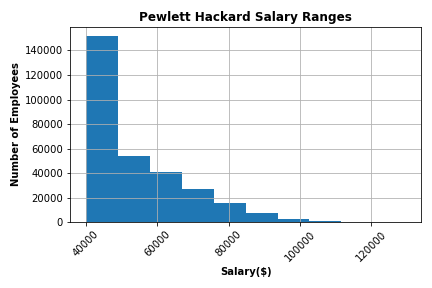
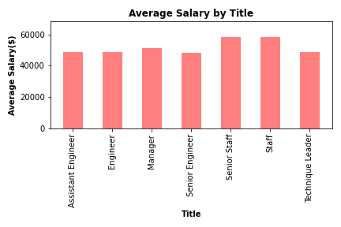

# A Mystery in Two Parts

## Background

As a new data engineer at Pewlett Hackard, a research project on employees of the corporation from 1980s and 1990s was assigned. There are 2 parts of this project; data engineering and data analysis. The process contains designing the tables to hold data in the CSVs, importing the CSVs into a SQL database, and answering questions about the data. 

## Data Engineering

### Entity Relationship Diagram (ERD)

- emp_no in employees table has a ***many-to-one*** relationships to emp_no in dept_emp and dept_manager tables.
- emp_no in employees table has a ***one-to-one*** relationships to emp_no in salaries table.
- title_id in titles table has a ***many-to-one*** relationships to emp_title_id in employees table.
- dept_no in departments table has a ***many-to-one*** relationships to dept_no in dept_emp and dept_manager tables.


### Database

- Create `employee_db` database in PostgreSQL 
- Import [schema](EmployeeSQL/employee_schema.sql) into database created
- Import [csv files](Resources) to tables created as the following order:

  * [titles](Resources/titles.csv)
  * [employees](Resources/employees.csv)
  * [departments](Resources/departments.csv)
  * [dept_emp](Resources/dept_emp.csv)
  * [dept_manager](Resources/dept_manager.csv)
  * [salaries](Resources/salaries.csv)

## Data Analysis
*Including a query excecuted in order to answer each question.*

### Part I: Reserch Questions
 
[**Query-I:**](EmployeeSQL/Q1.sql) List the following details of each employee: employee number, last name, first name, sex, and salary.

```javascript
SELECT e.emp_no, e.last_name, e.first_name, e.sex, s.salary
FROM employees as e
LEFT JOIN salaries as s
ON e.emp_no = s.emp_no;|
```

[**Query-II:**](EmployeeSQL/Q2.sql) List first name, last name, and hire date for employees who were hired in 1986.

```javascript
SELECT first_name, last_name, hire_date
FROM employees
WHERE hire_date BETWEEN '1986-01-01' AND '1986-12-31';
```

[**Query-III:**](EmployeeSQL/Q3.sql) List the manager of each department with the following information: department number, department name, the manager's employee number, last name, first name.

```javascript
SELECT dm.dept_no, d.dept_name, dm.emp_no, e.last_name, e.first_name
FROM dept_manager AS dm
JOIN departments AS d 
ON dm.dept_no = d.dept_no
JOIN employees AS e 
ON dm.emp_no = e.emp_no;
```

[**Query-IV:**](EmployeeSQL/Q4.sql) List the department of each employee with the following information: employee number, last name, first name, and department name.

```javascript
SELECT e.emp_no, e.last_name, e.first_name, d.dept_name
FROM employees AS e
JOIN dept_emp AS de
ON e.emp_no = de.emp_no
JOIN departments AS d
ON de.dept_no = d.dept_no;
```

[**Query-V:**](EmployeeSQL/Q5.sql) List first name, last name, and sex for employees whose first name is "Hercules" and last names begin with "B."

```javascript
SELECT first_name, last_name, sex
FROM employees 
WHERE first_name = 'Hercules'
AND last_name LIKE 'B%';
```

[**Query-VI:**](EmployeeSQL/Q6.sql) List all employees in the Sales department, including their employee number, last name, first name, and department name.

```javascript
SELECT e.emp_no, e.last_name, e.first_name, d.dept_name
FROM employees AS e
JOIN dept_emp AS de
ON e.emp_no = de.emp_no
JOIN departments AS d
ON de.dept_no = d.dept_no
WHERE d.dept_name = 'Sales';
```

[**Query-VII:**](EmployeeSQL/Q7.sql) List all employees in the Sales and Development departments, including their employee number, last name, first name, and department name.

```javascript
SELECT e.emp_no, e.last_name, e.first_name, d.dept_name
FROM employees AS e
JOIN dept_emp AS de
ON e.emp_no = de.emp_no
JOIN departments AS d
ON de.dept_no = d.dept_no
WHERE d.dept_name IN ('Sales', 'Development');
```

[**Query-VIII:**](EmployeeSQL/Q8.sql) In descending order, list the frequency count of employee last names, i.e., how many employees share each last name.

```javascript
SELECT last_name,
COUNT(*) AS "Frequency of Last name"
FROM employees
GROUP BY last_name
ORDER BY "Frequency of Last name" DESC;
```

### Part I: Bonus

[**Bonus-I:**](https://nbviewer.jupyter.org/github/abpuccini/sql-challenge/blob/main/Employee_DB.ipynb) The most common salary ranges for employees 
*Import database into Jupyter Notebook to visualize the data*

<p align="center">
  
</p>

The most common salary for Pewlett Hackard's employees is between $40,000 and $50,000.

[**Bonus-II:**](EmployeeSQL/bonus_q2.sql) Average salary by title

- In postgres: Calculation of average salary by title stored in view

```javascript
CREATE VIEW "avg_salary_title" AS
SELECT t.title,
ROUND(AVG(s.salary),2) AS "avg salary"
FROM employees AS e 
JOIN salaries AS s
ON e.emp_no = s.emp_no
JOIN titles as t
ON e.emp_title_id = t.title_id
GROUP BY t.title;

SELECT * FROM avg_salary_title;
```

- In [Jupyter Notebook](https://nbviewer.jupyter.org/github/abpuccini/sql-challenge/blob/main/Employee_DB.ipynb): Import view to visualize data 

<p align="center">
  
</p>

[**Epilogue:**](EmployeeSQL/bonus-epilogue.sql)

After giving a presentation to my boss, I heard the word, "Search your ID number." Then, I looked up for ID 499942 and found that the name and hire date were incorrect. That name was April Foolday and hire date is before I was born. Therefore, I changed it to my name and hire date to November 4, 2020. :wink:   

```javascript
SELECT * FROM employees
WHERE emp_no = 499942;

UPDATE employees
SET (last_name, first_name, hire_date) = ('Puccini', 'Atcharaporn', '2020-11-04')
WHERE emp_no = 499942;

SELECT e.emp_no, e.last_name, e.first_name, e.hire_date, d.dept_name
FROM employees AS e
JOIN dept_emp AS de
ON e.emp_no = de.emp_no
JOIN departments AS d
ON de.dept_no = d.dept_no
WHERE e.emp_no = 499942;
```

---
© [Atcharaporn B Puccini](https://www.linkedin.com/in/atcharaporn-puccini-233614118)