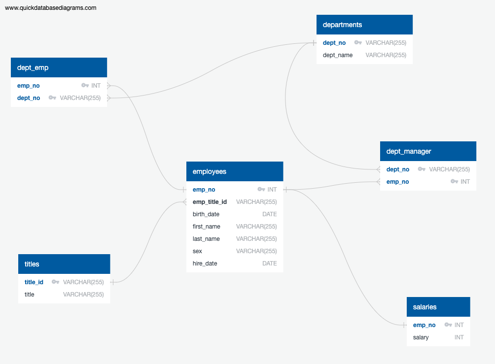

# Employee Database: A Mystery in Two Parts

## Background

As a new data engineer at Pewlett Hackard, a research project on employees of the corporation from 1980s and 1990s was assigned. There are 2 parts of this project; data engineering and data analysis. The process contains designing the tables to hold data in the CSVs, importing the CSVs into a SQL database, and answering questions about the data. 

### Data Engineering

**Entity Relationship Diagram (ERD)**

  

### Data Analysis

